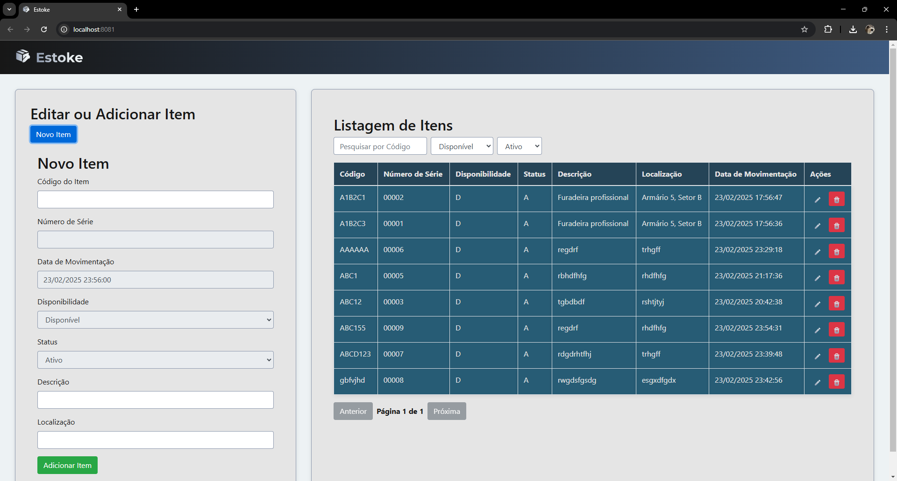

# 📦 Estoke - Gestão de Inventário Inteligente


Bem-vindo ao **Estoke**, o sistema perfeito para organizar e gerenciar seu inventário de maneira eficiente e intuitiva! 🎯

> **"Se está desorganizado, está perdido!"** - Um sábio gestor de estoque 🤓

## 🚀 Sobre o Projeto

O **Estoke** é uma aplicação moderna para controle de inventário, desenvolvida para oferecer uma experiência fluida e intuitiva. Com recursos como **cadastro de itens, listagem filtrada, paginação, validações robustas e feedback amigável**, o Estoke facilita o dia a dia da gestão de estoque!

---

## 🖥️ Demonstração

Aqui está uma prévia do sistema **Estoke** em ação! 🔥  



---

## 🛠️ Tecnologias Utilizadas

O Estoke foi construído com tecnologias modernas e performáticas:

### 🔹 **Frontend (Vue.js + TypeScript)**
- Vue.js 2 + TypeScript 🏗️
- Bootstrap para uma interface responsiva 📱
- Axios para comunicação com a API 🔄
- Validações em tempo real nos formulários ✅
- Atualização dinâmica dos dados 📡

### 🔹 **Backend (Spring Boot + Java)**
- Spring Boot 🚀
- JPA para persistência de dados 🗄️
- PostgreSQL como banco de dados 🗂️
- Validações com Bean Validation 🛡️
- Mensagens de erro amigáveis e padronizadas 📢

---

## 🎯 Principais Funcionalidades

✅ **Cadastro de Itens** com número de série gerado automaticamente 📜  
✅ **Listagem filtrada** por código, disponibilidade e status 🧐  
✅ **Paginação automática** para melhor desempenho ⚡  
✅ **Mensagens de erro e sucesso** exibidas de forma amigável 😃  
✅ **Desabilitação de campos sensíveis** para evitar edições indevidas ✋  
✅ **Relógio de movimentação** mostrando segundos em tempo real 🕒  
✅ **Integração com API REST** 🚀  

---

## 🚀 Como Rodar o Projeto

### 🔧 **1. Clone o repositório**
```bash
git clone https://github.com/SorayaYF/Estoke.git
cd Estoke
```
---
### 💻 2. Configurar o Backend (Spring Boot)
1. Instale o **Java 17+** e o **Maven**
2. Configure o banco de dados (PostgreSQL) e ajuste `application.properties`
3. Rode a aplicação:
   ```bash
   mvn spring-boot:run
   ```
---
### 🎨 3. Configurar o Frontend (Vue.js)
1. Instale o **Node.js (v16+)**
2. Dentro da pasta do frontend, instale as dependências:
   ```bash
   npm install
   ```
3. Inicie a aplicação:
   ```bash
   npm run serve
   ```
4. Acesse no navegador: http://localhost:8081 🚀
   
## 📡 API e Postman

Para testar os endpoints da API do **Estoke**, utilize a coleção do **Postman** disponível aqui:  

📥 **[Baixar Coleção do Postman](./Estoke.postman_collection.json)**

### 🔄 Endpoints disponíveis:

- **GET** `/itens-inventario` → Lista todos os itens do inventário.
- **POST** `/itens-inventario` → Adiciona um novo item.
- **PUT** `/itens-inventario` → Atualiza um item existente.
- **DELETE** `/itens-inventario/id/{id}` → Inativa um item pelo ID.
- **GET** `/itens-inventario/proximo-numero-serie` → Retorna o próximo número de série disponível.

💡 A coleção inclui **requisições para listar, adicionar, editar e excluir itens do inventário** de forma prática e organizada.

---
